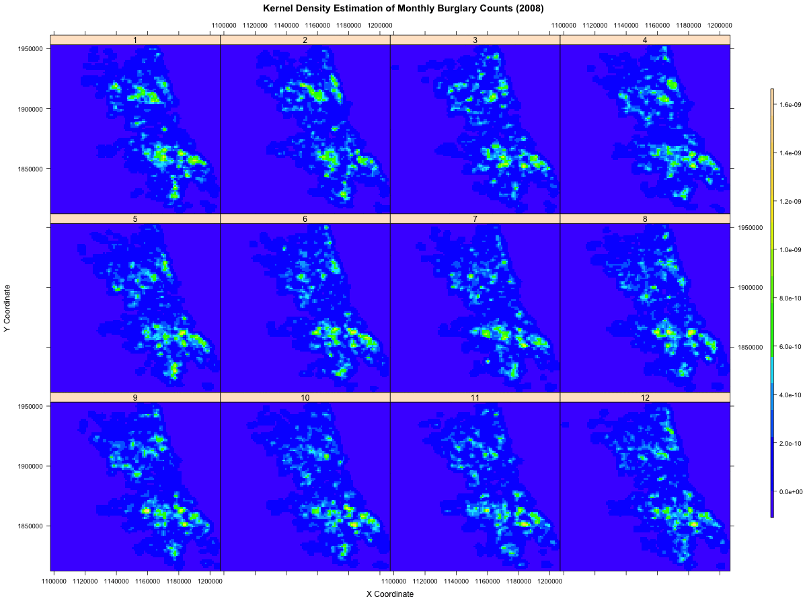

```{r load-data,echo=FALSE, cache=TRUE}
setwd("/Users/xiaomuliu/CrimeProject/SpatioTemporalModeling/ExploratoryAnalysis/BurglaryAnalysis/")
source("importCrimeData.R")
filePath <- "/Users/xiaomuliu/CrimeProject/SpatioTemporalModeling/ExploratoryAnalysis/CPD_DWH/"
fileName <- "X_BURGLARY_POINTS_08_14.csv"
BurglaryData <- importCrimeData(filePath,fileName)
row.names(BurglaryData) <- NULL
```

The data which was pulled from CPD data warehouse has a format that looks like:
```{r head,echo=FALSE,cache=TRUE}
head(BurglaryData,3)
```

A preview of the variables
```{r str,echo=FALSE, cache=TRUE}
str(BurglaryData)
```

A summary of the data
```{r summary, cache=TRUE}
summary(BurglaryData)
```

From the summary, we can already see burglaries have different weekly pattern as weekend has significantly less incidents than weekday. The majority of burglary type is 0610 which is *Forcible Entry* (0620: *Unlawful Entry*; 0630: *Attempt Forcible Entry*; 0650: *Home Invasion*). The top three location types are 290: *Residence*;090 *Apartment*;210 *Residence Garage*

The summary of how the crime counts are distributed in each **area**
```{r,echo=FALSE, cache=TRUE}
table(BurglaryData$AREA,useNA="ifany")
```
and in each **district**
```{r,echo=FALSE, cache=TRUE}
table(BurglaryData$DISTRICT,useNA="ifany")
```
What needs to be noticed is District 31 only has 1 incidents during the 7 year period.

Most of the missing values (only in attribute AREA,DISTRICT and BEAT) have identical row indices.
```{r missing,echo=FALSE,results='hide', cache=TRUE}
which(is.na(BurglaryData$AREA))
which(is.na(BurglaryData$DISTRICT))
which(is.na(BurglaryData$BEAT))
```

From the shape files provided by CPD, the area, district and beat polygon map are shown below
```{r shp-plot,echo=FALSE,message=FALSE, warning=FALSE, fig.showtext=FALSE, fig.width=10,fig.height=5, cache=TRUE}
library(rgdal)
shapefilePath <- "/Users/xiaomuliu/CrimeProject/SpatioTemporalModeling/CPDShapeFiles/"
area.rg <- readOGR(shapefilePath, "area_bndy")
district.rg <- readOGR(shapefilePath, "district_bndy")
beat.rg <- readOGR(shapefilePath, "beat_bndy")
par(mfrow=c(1,3))
plot(area.rg, border="black",main="CPD AREAS")
box(which = "plot", lty = "solid")
plot(district.rg, border="black",main="CPD DISTRICTS")
box(which = "plot", lty = "solid")
plot(beat.rg, border="black",main="CPD DISTRICTS")
box(which = "plot", lty = "solid")
```

```{r SpTemplate,echo=FALSE, message=FALSE, warning=FALSE, cache=TRUE,eval=FALSE}
Crd.beat <- coordinates(beat.rg)
Crd.district <- coordinates(district.rg)
# create a spatial polygon data frame template
library(sp)
beat_template.spdf <- beat.rg
beat_template.spdf@data$BEAT_NUMBE <- as.factor(as.integer(as.character(beat_template.spdf@data$BEAT_NUMBE)))
beat_template.spdf@data$INC_CNT <- rep(NA,nrow(beat_template.spdf@data))

district_template.spdf <- district.rg
district_template.spdf@data$DISTRICT <- as.factor(as.integer(as.character(district_template.spdf@data$DISTRICT)))
district_template.spdf@data$INC_CNT <- rep(NA,nrow(district_template.spdf@data))

BeatList <- sort(unique(beat_template.spdf@data$BEAT_NUMBE))
DistrictList <- sort(unique(district_template.spdf@data$DISTRICT))
```

A scatter point plot of burglary locations for a certain day (*2014-01-01*)
```{r pts-shp-plot,echo=FALSE, message=FALSE, warning=FALSE, cache=TRUE}
day <- as.Date("2014-01-01")
DailyCrime <- subset(BurglaryData,DATEOCC == day,select = c("DATEOCC","X_COORD","Y_COORD","INC_CNT"))
DailyCrime.sp <- SpatialPoints(coords=DailyCrime[,c("X_COORD","Y_COORD")])
plot(district.rg, border="black",main=list(paste("Violent Crime Locations (", day,")",sep=""),cex=0.75))
points(DailyCrime.sp,pch=16, cex=.75,col="red")
```

Let's first aggregate data by policing beat/district. Both of the plots below try to unveil if different districts have similar seasonal patterns or not.

```{r aggregate-district, echo=FALSE, message=FALSE, warning=FALSE, fig.width=10,fig.height=8, cache=TRUE}
# aggregated by "beat"/"district"
BurglaryData.beat <- aggregate(INC_CNT~BEAT+DATEOCC+YEAR+MONTH+DOW,data=BurglaryData, FUN=sum, na.rm=TRUE)
BurglaryData.beat <- BurglaryData.beat[order(BurglaryData.beat$DATEOCC),]
BurglaryData.district <- aggregate(INC_CNT~DISTRICT+DATEOCC+YEAR+MONTH+DOW,data=BurglaryData, FUN=sum, na.rm=TRUE)
BurglaryData.district <- BurglaryData.district[order(BurglaryData.district$DATEOCC),]
BurglaryData.beat_month <- aggregate(INC_CNT~BEAT+YEAR+MONTH,data=BurglaryData.beat, FUN=sum, na.rm=TRUE)
BurglaryData.beat_month <- BurglaryData.beat_month[order(BurglaryData.beat_month$YEAR,BurglaryData.beat_month$MONTH),]
BurglaryData.district_month <- aggregate(INC_CNT~DISTRICT+YEAR+MONTH,data=BurglaryData.district, FUN=sum, na.rm=TRUE)
BurglaryData.district_month <- BurglaryData.district_month[order(BurglaryData.district_month$YEAR,BurglaryData.district_month$MONTH),]

library(lattice)
xyplot(INC_CNT ~ DATEOCC | DISTRICT, data = BurglaryData.district, pch=16, cex=0.5, layout = c(6, 5),
       as.table=TRUE, xlab="Day", ylab="Burglary Count", 
       main=list(label="Daily Burglary Counts over each District (2008-2014)",cex=0.8))

xyplot(INC_CNT ~ MONTH | DISTRICT, data = BurglaryData.district_month, groups = YEAR, pch=16, cex=0.5, layout = c(6, 5), 
       as.table=TRUE, col=c("black","yellow","blue","red","green","purple","orange"), 
       key=list(text=list(as.character(2008:2014)),points=list(pch=16),cex=1,space="bottom",
                col=c("black","yellow","blue","red","green","purple","orange")),
       xlab="Month", ylab="Burglary Count", 
       main=list(label="Monthly Burglary Counts over each District (2008-2014)",cex=0.8))
```

The top plot shows the daily crime time series. Note that the series of district 13, 21, and 23 seem to be truncated. It turned out that data of distirct 13, 21 and 13 is only avaiable up to 2012/12/16, 2013/03/02, and 2013/03/01 respectively. For the bottom plot, the crime counts were first grouped in year and then aggregated by district and month.

Grouping by beat would present higher resolution view of spatial and temporal patterns. However, as we have nearly 300 beats, instead of using muit-panel plot, we resorted to heap map to show these patterns.

```{r aggregate-beat, echo=FALSE, message=FALSE, warning=FALSE, fig.width=7,fig.height=7, fig.align='center',cache=TRUE}
library(reshape)
# reshape the monthly beat data to wide format 
beat_month.long <- BurglaryData.beat_month[order(BurglaryData.beat_month$BEAT,BurglaryData.beat_month$YEAR),]
beat_month.wide <- cast(beat_month.long, BEAT~YEAR+MONTH, fun.aggregate=sum)
row.names(beat_month.wide) <- beat_month.wide$BEAT
beat_month.matrix <- data.matrix(beat_month.wide[,2:ncol(beat_month.wide)])

library(fields)
par(mar=c(5,5,5,7)) 
image(x=1:ncol(beat_month.matrix),y=1:nrow(beat_month.matrix),z=t(beat_month.matrix), col=topo.colors(256),axes=FALSE,
      xlab="",ylab="Beat",main="Monthly Burglary Counts over each Beat (2008-2014)",cex.main=0.8)
axis(side=1,at=1:ncol(beat_month.matrix), labels = colnames(beat_month.matrix),las=2,cex.axis = 0.8)
axis(side=2,at=1:nrow(beat_month.matrix), labels = rownames(beat_month.matrix),las=2,cex.axis = 0.3)
box()
image.plot(x=1:ncol(beat_month.matrix),y=1:nrow(beat_month.matrix),z=t(beat_month.matrix), col=topo.colors(256),
           legend.only=TRUE,legend.width=0.6)
```

Again, some beats have strong decreaseing periodic seasonal trend while some others don't. And the burglary counts in adjacent beats are usually close. 

Now let's shift from policing regional study to city-wide analysis. Here is an incident location plot for each month of year 2014.

```{r monthly-pts, echo=FALSE, message=FALSE, warning=FALSE, fig.width=10,fig.height=8, cache=TRUE}
figPath = "/Users/xiaomuliu/CrimeProject/SpatioTemporalModeling/ExploratoryAnalysis/BurglaryAnalysis/"
year = 2014  
BurglaryData.byYear <- subset(BurglaryData,YEAR==year,select=c(MONTH,X_COORD,Y_COORD,INC_CNT))
xyplot(Y_COORD ~ X_COORD | factor(MONTH), data=BurglaryData.byYear, pch=16, cex=0.4,as.table=TRUE,
              xlab="X Coordinate", ylab="Y Coordinate",
              main=list(label=paste("Violent Crime Locations over each Month (",as.character(year),")",sep=""), cex=0.8))
```

It is difficult to examine if crime location clusters are time-varying just by looking at the point plots. Let's move to grid(pixel)-based analysis. First, the point data was rasterized through binning into a 100 $\times$ 100 grid (the boundaries were defined by the range of x-coordinate and y-coordinate from all available crime locations plus a margin of 1000 unit on each side). Here shows an example of pixelized violent crime locations in January 2014.

```{r raster, echo=FALSE, message=FALSE, warning=FALSE, fig.align='center',cache=TRUE}
X_range = range(BurglaryData$X_COORD)
Y_range = range(BurglaryData$Y_COORD)
margin = 1000
X_range[1] <- X_range[1]-margin
X_range[2] <- X_range[2]+margin
Y_range[1] <- Y_range[1]-margin
Y_range[2] <- Y_range[2]+margin

year = 2014
month = 1
BurglaryData.byYearMonth <- subset(BurglaryData,YEAR==year&MONTH==month,select=c(X_COORD,Y_COORD,INC_CNT))

library(sp)
library(raster)
r <- raster(ncol=100,nrow=100,xmn=X_range[1],xmx=X_range[2],ymn=Y_range[1],ymx=Y_range[2])
BurglaryData.YMraster <- rasterize(BurglaryData.byYearMonth[,c("X_COORD","Y_COORD")], r, 
                                   BurglaryData.byYearMonth$INC_CNT, fun=sum)
plot(BurglaryData.YMraster,panel.first=grid(100,100,col = "lightgray", lty = "dotted"),col=topo.colors(256))
```

Next, we do kernel density estimation (KDE) of the monthly aggregation over each year. The kernel applied here is a 2D Gaussian kernel with the same bandwidth in each direction. The bandwidth was selected through (minimizing MSE) cross-valiation using all available data (08-14).

```{r bw-kernel, echo=FALSE, message=FALSE, warning=FALSE, fig.width=5,fig.height=5, fig.align='center', cache=TRUE}
# First find the opitmal bandwidth of the Gaussian kernels through cross-valiation (minimizing MSE, data 08-14)
library(spatstat)
BurglaryData.raster <- rasterize(BurglaryData[,c("X_COORD","Y_COORD")], r, BurglaryData$INC_CNT, fun=sum)
rasterMat <- matrix(BurglaryData.raster@data@values,100,100)
rasterMat[is.na(rasterMat)] = 0
grd <- expand.grid(list(X_COORD = seq(X_range[1], X_range[2], length.out=100), 
                        Y_COORD = seq(Y_range[1], Y_range[2], length.out=100)))
BurglaryData.pp <- ppp(grd$X_COORD,grd$Y_COORD,window=owin(xrange=X_range,yrange=Y_range),marks=as.vector(rasterMat))
h <- bw.diggle(BurglaryData.pp)
plot(h,ylab="MSE",main=list("Find the opitmal kernel bandwidth via minimizing-MSE CV",cex=0.8))
h <- round(as.numeric(h))
```

```{r KDE-example, echo=FALSE, message=FALSE, warning=FALSE, fig.width=10,fig.height=8, eval=FALSE,cache=TRUE}
# Now apply this optimal kernel to each monthly-aggregated data
library(KernSmooth)
KDE.df <- do.call(rbind, replicate(12, grd, simplify = FALSE))
KDE.df$MONTH = rep(1:12, each=10000)
KDE.df$VALUE = rep(NA,12*10000)

for (j in 1:12){
  BurglaryData.YMsub <- subset(BurglaryData,YEAR==year&MONTH==j,select=c(X_COORD,Y_COORD,INC_CNT))
    
  kernSm <- bkde2D(data.matrix(BurglaryData.YMsub[,c("X_COORD","Y_COORD")]), bandwidth=c(h,h), 
                    gridsize=c(100, 100), range.x=list(X_range,Y_range))
    
  KDE.df[KDE.df$MONTH==j,]$VALUE <- as.vector(kernSm$fhat)     
}
levelplot(VALUE~X_COORD*Y_COORD|as.factor(MONTH), data=KDE.df,col.regions=topo.colors(256),as.table=TRUE,
          xlab="X Coordinate", ylab="Y Coordinate", colorkey=list(width=0.5,height=0.8),
          main = list(label=paste("Kernel Density Estimation of Monthly Burglary Counts (",as.character(year),")",
                 sep=""), cex=0.8))
```

Here displays an animation of KDE for each year (08-14).

```{r kde-animation, echo=FALSE, message=FALSE, warning=FALSE, cache=TRUE}
library(KernSmooth)
library(animation)
flag<-saveGIF({# KDE looping over month and year
  for (k in unique(BurglaryData$YEAR)){  
    # create a KDE data frame for 'leveplot'
    grd <- expand.grid(list(X_COORD = seq(X_range[1], X_range[2], length.out=100), 
                            Y_COORD = seq(Y_range[1], Y_range[2], length.out=100)))
    KDE.df <- do.call(rbind, replicate(12, grd, simplify = FALSE))
    KDE.df$MONTH = rep(1:12, each=10000)
    KDE.df$VALUE = rep(NA,12*10000)
    
    for (j in 1:12){
      BurglaryData.YMsub <- subset(BurglaryData,YEAR==k&MONTH==j,select=c(X_COORD,Y_COORD,INC_CNT))
      
      kernSm <- bkde2D(data.matrix(BurglaryData.YMsub[,c("X_COORD","Y_COORD")]), bandwidth=c(h,h), 
                       gridsize=c(100, 100), range.x=list(X_range,Y_range))
      
      KDE.df[KDE.df$MONTH==j,]$VALUE <- as.vector(kernSm$fhat)     
    }
    
    f <- levelplot(VALUE~X_COORD*Y_COORD|as.factor(MONTH), data=KDE.df,col.regions=topo.colors(256),as.table=TRUE,
                   xlab="X Coordinate", ylab="Y Coordinate", colorkey=list(width=0.5,height=0.8),
                   main = list(label=paste("Kernel Density Estimation of Monthly Burglary Counts (",as.character(k),")",
                                           sep=""), cex=1.2))
    print(f)
  }
},movie.name = paste(figPath,"KDE_burglary_08_14_animation.gif",sep=""), ani.width=1200, ani.height=900, interval=1)
```

 
